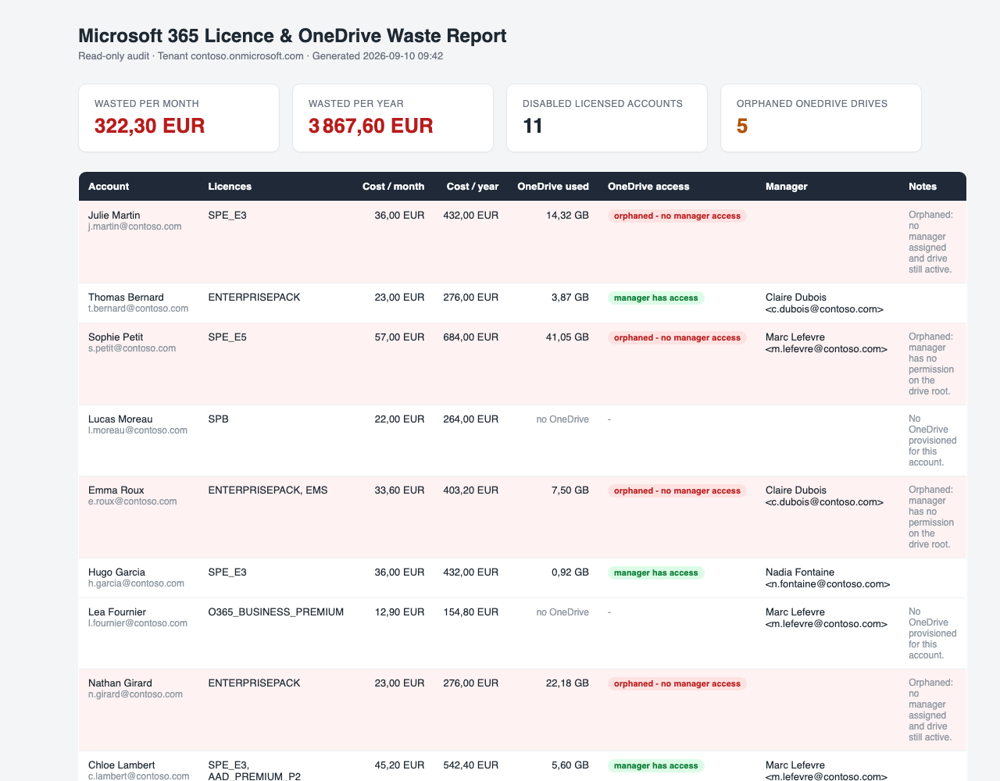

# M365 License and OneDrive Waste Finder

A read-only PowerShell audit for Microsoft 365 that puts a euro figure on the licences still assigned to disabled accounts, and flags orphaned OneDrive drives that nobody can reach any more. Microsoft Graph SDK only, no deprecated modules, no on-premises Active Directory.



The report above was generated from fictional data (contoso.com). Open [Docs/example-report.html](Docs/example-report.html) to see the actual file the script produces.

## The problem

When an employee leaves, the account is usually disabled but the licence is frequently left in place, and Microsoft keeps billing for it. The Microsoft 365 admin center has no native report that crosses "account disabled" with "licence assigned", so these seats accumulate silently, often for months. The same goes for OneDrive: the disabled user's drive stays online with its sharing links active, and when the licence is finally removed the data is deleted after the retention period, at which point nobody may hold access to recover it. This script gives you both views in one run, with a management-ready HTML report and a CSV for your own analysis.

## What the script does

1. Connects to Microsoft Graph with delegated read-only scopes (interactive sign-in by default).
2. Reads the tenant's subscribed SKUs to translate each licence `SkuId` into its `SkuPartNumber`.
3. Lists every account where `accountEnabled` is false and at least one licence is assigned.
4. Prices each licence from a table you control in `Config/Config.ps1` and sums the monthly and yearly waste.
5. For each of those accounts, checks the OneDrive: does a drive exist, how much is stored, and does the account's manager hold a permission on the drive root. Each account receives one of four statuses: `Orphaned` (active drive, no manager access), `Delegated` (manager has access), `NotProvisioned` (no drive) or `NotAccessible` (the auditing account was refused access, so nothing could be checked).
6. Optionally lists still-enabled accounts with no interactive sign-in for a configurable number of days (informational, not counted in the total).
7. Writes a self-contained HTML report and a CSV export, both timestamped, plus a per-run log, and prints a headline summary to the console.

A failure on one account (no drive, a permission it cannot read, a transient error) is logged and the scan continues with the next account.

## Why it is safe to run

The script performs no write operation of any kind. Every Graph scope it requests is a `*.Read.*` scope, and the only Graph cmdlets it calls are `Connect-MgGraph`, `Disconnect-MgGraph` and `Get-*` cmdlets:

- `Get-MgSubscribedSku`
- `Get-MgUser`
- `Get-MgUserManager`
- `Get-MgUserDefaultDrive`
- `Get-MgDriveRootPermission`

There is no `-WhatIf` because there is nothing to simulate. Granting the requested permissions cannot enable the script to disable, delete or re-license anything.

`Files.Read.All` sounds broad, so it is worth being precise. The script uses it for two calls only: reading the drive object (to know whether a OneDrive exists and how much quota is used) and reading the permissions on the drive root (to know whether the manager has access). It never enumerates, opens, downloads or reads the content of any file.

The Graph session is closed in a `finally` block at the end of every run, whether the audit succeeded or failed.

## Requirements

- PowerShell 7.0 or later (Windows PowerShell 5.1 is not enough). The Windows launcher offers to install it through winget if it is missing.
- These Microsoft Graph PowerShell SDK modules, all on the same version:
  - `Microsoft.Graph.Authentication`
  - `Microsoft.Graph.Users`
  - `Microsoft.Graph.Identity.DirectoryManagement`
  - `Microsoft.Graph.Files`
- An account that can consent to the scopes below, or a tenant where an administrator has already consented.

## Installation

Clone the repository or download it as a zip:

```powershell
git clone https://github.com/AymerickVic/m365-license-onedrive-waste-finder.git
cd m365-license-onedrive-waste-finder
```

Install the Graph modules. The simplest way is the meta-module, which pulls a consistent set of every sub-module:

```powershell
Install-Module Microsoft.Graph -Scope CurrentUser
```

If you prefer to install only what the audit uses, install the four modules in one sitting so they land on the same version:

```powershell
Install-Module Microsoft.Graph.Authentication, Microsoft.Graph.Users, Microsoft.Graph.Identity.DirectoryManagement, Microsoft.Graph.Files -Scope CurrentUser
```

Then edit `Config/Config.ps1`. It is the only file you need to touch:

- `LicensePriceTable` holds indicative public list prices in EUR per user per month. Replace them with your contracted rates before quoting a figure to anyone. A SKU that is not in the table is priced at 0 EUR and reported with a warning naming the SKU, so the audit never fails on an unknown licence.
- `TenantId` and `ClientId` can stay empty for interactive sign-in with the built-in Microsoft Graph PowerShell application. Fill them in only if you registered a dedicated application (see [Docs/GraphPermissions.md](Docs/GraphPermissions.md)).
- `GraphScopes` lists the delegated scopes requested at sign-in. Remove `AuditLog.Read.All` if you never use the inactivity option.
- `InactivityThresholdDays` (default 90) is used only by `-IncludeInactiveEnabled`.
- `ReportPath` and `LogPath` default to the `Reports` and `Logs` folders of the project and are created at run time if missing.

### The Microsoft.Graph version mismatch trap

Every `Microsoft.Graph.*` sub-module depends on a specific version of `Microsoft.Graph.Authentication`. When two sub-modules on the machine are on different versions, PowerShell refuses to load them together:

```text
Could not load file or assembly 'Microsoft.Graph.Authentication, Version=x.y.z'.
Assembly with same name is already loaded
```

The script guards against this instead of failing with that message. Before connecting, it lists the installed versions of each required module, computes the highest version present for all of them, and imports each module with `-RequiredVersion` set to that value. If no common version exists, it prints the versions it found for each module and the command to fix it, then stops. The fix is to align everything to one version:

```powershell
Update-Module Microsoft.Graph -Force
```

Then open a new PowerShell window before running again. An assembly that is already loaded in a session cannot be swapped out mid-session.

## Usage

The launchers handle the working directory, the execution policy and the module check for you.

On Windows, double-click `Run-Audit.cmd`. It locates PowerShell 7 (PATH, Program Files or the Store install), offers to install it via winget if absent, and runs the audit with the execution policy bypassed for that single run. It accepts the same parameters from a command prompt:

```bat
Run-Audit.cmd -TenantId contoso.onmicrosoft.com
```

On macOS or Linux:

```bash
pwsh ./Run-Audit.ps1
```

You can also run the audit script directly:

```powershell
./Scripts/Invoke-WasteAudit.ps1
```

A Microsoft sign-in window opens on the first run. Authenticate with an administrator account and accept the read-only permissions. If a Graph session already exists in the PowerShell session and carries every required scope, it is reused instead.

### Parameters

All three parameters are accepted by both `Run-Audit.ps1` and `Scripts/Invoke-WasteAudit.ps1` and are optional.

`-TenantId <tenant>` signs in to a specific tenant, given as a domain (`contoso.onmicrosoft.com`) or the tenant GUID. It overrides `TenantId` in `Config.ps1`. Use it when your account can reach several tenants, or when the account is a personal Microsoft account that administers an organisation tenant. The script refuses to continue when the token targets the personal "consumers" tenant, because there is no directory to audit there.

```powershell
./Scripts/Invoke-WasteAudit.ps1 -TenantId "contoso.onmicrosoft.com"
```

`-IncludeInactiveEnabled` additionally lists accounts that are still enabled but whose last interactive sign-in is older than `InactivityThresholdDays`. These are written to a separate CSV and are not added to the waste total, because an enabled account may be a legitimate service or shared account. Reading `signInActivity` requires the `AuditLog.Read.All` scope and an Entra ID P1 licence on the tenant. Without P1 the script logs a warning and continues without that list.

```powershell
./Scripts/Invoke-WasteAudit.ps1 -IncludeInactiveEnabled
```

`-UseDeviceCode` signs in with the device-code flow: the script prints a short code and the URL https://microsoft.com/devicelogin, which you open in any browser. Use it on Windows when the account broker keeps selecting the wrong account or forces a passkey you cannot complete.

```powershell
./Scripts/Invoke-WasteAudit.ps1 -UseDeviceCode
```

### Output

Everything is timestamped and written under `Reports/` and `Logs/` (both ignored by git):

| File | Content |
|------|---------|
| `Reports/WasteReport-<timestamp>.html` | Self-contained report (inline CSS, no external dependency). Summary cards, a warning box when some drives could not be read, then a per-account table. |
| `Reports/WasteReport-<timestamp>.csv` | One row per disabled licensed account: `DisplayName`, `UserPrincipalName`, `AccountEnabled`, `Licenses`, `MonthlyCostEur`, `YearlyCostEur`, `OneDriveActive`, `OneDriveUsedGB`, `OneDriveStatus` (Orphaned, Delegated, NotProvisioned or NotAccessible), `Manager`, `Notes`. |
| `Reports/InactiveEnabled-<timestamp>.csv` | Only with `-IncludeInactiveEnabled` and when matches are found. |
| `Logs/WasteAudit-<timestamp>.log` | Full run log, same INFO / WARN / ERROR / SUCCESS lines as the console. |

## Microsoft Graph scopes

All scopes are delegated and read-only. They require administrator consent because they read directory-wide data.

| Scope | Required | Why the script needs it |
|-------|----------|-------------------------|
| `User.Read.All` | Yes | List users, read `accountEnabled`, `assignedLicenses` and each account's manager (`Get-MgUser`, `Get-MgUserManager`). |
| `Organization.Read.All` | Yes | Read the tenant's subscribed SKUs to map a licence `SkuId` to its `SkuPartNumber` (`Get-MgSubscribedSku`). |
| `Files.Read.All` | Yes | Read each disabled account's OneDrive metadata: drive existence and used quota (`Get-MgUserDefaultDrive`) and the permissions on the drive root (`Get-MgDriveRootPermission`). Never file content. Only works on drives the signed-in administrator can already access, see Known limitations. |
| `AuditLog.Read.All` | Only with `-IncludeInactiveEnabled` | Read `signInActivity` to find long-inactive enabled accounts. Also needs Entra ID P1. Remove it from `GraphScopes` in `Config.ps1` if you never use the option. |

Setup details, including the optional dedicated app registration and how to grant admin consent, are in [Docs/GraphPermissions.md](Docs/GraphPermissions.md).

## Known limitations

- OneDrive inspection depends on the auditing administrator's own access to each drive. This was tested live on a lab tenant with a Microsoft 365 Business Premium licence: a disabled, licensed account with a provisioned OneDrive and a manager holding no permission on it. The licence waste was reported correctly (SPB, 22 EUR per month). The drive read, however, was answered by Microsoft Graph with `accessDenied`: with delegated `Files.Read.All`, a Global Administrator has no access to another user's OneDrive unless they are a site collection administrator of that personal site. This is the default state of a tenant, so expect it on a first run. Since version 1.0.2 the case is reported explicitly instead of being silently counted as "not orphaned": the account gets the status `NotAccessible`, a dedicated "Drives not accessible" counter appears next to the orphaned counter, and a warning box at the top of the report (and in the console) states that the OneDrive audit is incomplete, how many accounts are affected and how to grant access. The orphaned counter only ever counts drives that were actually read. To complete the OneDrive part, grant the auditing account access to the drives (Microsoft 365 admin center, user page, OneDrive tab, "Get access to files", or the SharePoint admin tools), then run the audit again. The script does not support application-only permissions as shipped.
- Because of the point above, the manager-access comparison itself (whether the manager's UPN or mail appears in the drive root permissions) has not been validated against a live tenant. It has only been exercised with synthetic permission data. Real-world permission shapes vary (direct grants, sharing links, sharing invitations). Check the OneDrive column against a known case before relying on it. The `NotAccessible` status, on the other hand, was validated live: the affected account was reported with that status, the counter and the warning.
- Accounts without a provisioned OneDrive are handled correctly, and this path was validated live. Graph returns "User's mysite not found", the account is listed for its licence cost with the note "No OneDrive provisioned for this account." and is not counted as an orphaned drive. Verified on accounts holding a Business Premium licence that never signed in, and on accounts holding only an Entra ID P2 licence.
- Prices are indicative until you set them. The shipped price table holds public list prices as a starting point. The totals are only as accurate as the values you enter in `Config.ps1`.
- Group-based licensing is not distinguished. The audit counts licences exactly as the directory reports them on the account, whether directly assigned or inherited from a group. Both represent a paid seat on a disabled account.
- The inactivity option needs Entra ID P1. Without it, Microsoft does not expose last sign-in data and the script skips that part with a warning.
- Personal Microsoft accounts are not supported as the audited identity. The script stops with a clear message if the sign-in lands on the consumers tenant.
- Windows account broker quirks. On machines with several cached Microsoft identities, the broker may pick the wrong account or demand a passkey. Use `-TenantId` and, if needed, `-UseDeviceCode`.

More detail on each point is in [Docs/README.md](Docs/README.md) and [Docs/FAQ.md](Docs/FAQ.md).

## Repository layout

```text
Config/Config.ps1               Only file to edit: scopes, price table, thresholds, paths
Scripts/Invoke-WasteAudit.ps1   The audit
Modules/Functions.ps1           Logging, module loading, Graph connection, pricing, HTML report
Run-Audit.cmd                   Windows launcher (double-click)
Run-Audit.ps1                   macOS / Linux launcher
Docs/                           Full documentation, Graph permissions, FAQ, quick start, example report
Reports/, Logs/                 Output folders, kept empty in git
PSScriptAnalyzerSettings.psd1   Lint settings used during development
```

## Automating the rest of the offboarding

This audit tells you what is being wasted. It deliberately changes nothing. A separate, paid pack automates the seven steps of a complete user departure: account disabling, licence and group removal, MFA method revocation, Intune device retirement, OneDrive delegation to the manager, mailbox conversion to shared, and an orchestrator that runs them in order. Details at https://edensys.blink.store/m365-license-onedrive-waste-finder?checkout=github-waste-finder.

## License

MIT. See [LICENSE](LICENSE).
